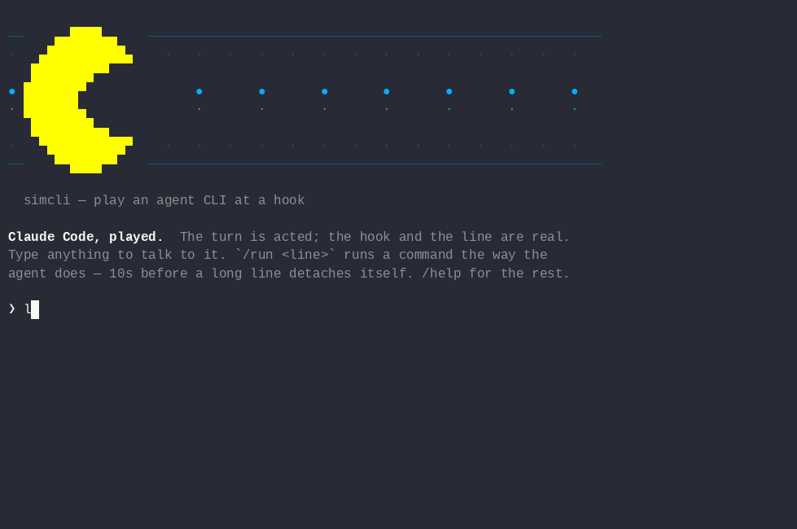

# simai-cli

**Play an agent CLI at a hook.**



```
❯ /run sleep 45; echo BOOM
● Bash(sleep 45; echo BOOM)
  ⎿  jbx: this passed 10s, so it is in the BACKGROUND as j9fdbcfe — nothing lost.
  ⎿  DO NOT WAIT FOR IT, DO SOMETHING ELSE.

❯ so it is still ticking?
  It is. Under an id, somewhere else, entirely on its own time.
  We have thirty-five seconds and absolutely nothing to do with them.
```

The agent is acted. **The bomb is real** — a real hook saw a real command,
rewrote it, and a real wrapper walked away from it. That is the only half
worth filming, and it is the half that is not faked.

`demo/boom.txt` is the whole script. `simcli --script demo/boom.txt
--capture boom.cast`, then `agg boom.cast boom.gif`.

## Why `--check` is the point
A hook that does not recognise a tool answers **nothing** — and so does a
hook watching for the wrong tool name. Silence means both "not mine" and
"I am misconfigured".

Not hypothetical: a widely used command proxy watches for `Bash` on
Cursor, Droid and Copilot, whose own references say `Shell`, `Execute`
and `bash`. Three hooks that never fire and look perfectly installed.

`--check` exits non-zero when the line came back unchanged, so a wrong
dialect fails a build instead of somebody's afternoon.

## The five
| `--as` | shell tool | event | the rewrite comes back at | chrome |
|---|---|---|---|---|
| `claude` | `Bash` | `PreToolUse` | `hookSpecificOutput.updatedInput.command` | yes |
| `gemini` | `run_shell_command` | `BeforeTool` | `hookSpecificOutput.tool_input.command` | yes |
| `droid` | `Execute` | `PreToolUse` | `hookSpecificOutput.updatedInput.command` | — |
| `cursor` | `Shell` | `preToolUse` | `updated_input.command` | — |
| `copilot` | `bash` | `preToolUse` | `modifiedArgs.command` | — |

`--check` works for all five. **Chrome is Claude and Gemini only** —
`--play` and the session need a screen, and dressing Cursor in Claude's
would look like proof of a client it never touched.

**[CLIENTS.md](CLIENTS.md)**: a page per client, generated from the code
that sends those payloads.

## Install
```console
npm install -g quazardous/simai-cli
simcli tools
```

Straight from git — nothing is published to a registry, and nothing has
to be. TypeScript builds it on install; there is **no runtime
dependency**, so that is the whole of it. Node 18 or later.

To work on it instead:

```console
git clone https://github.com/quazardous/simai-cli && cd simai-cli
npm install
npm test               # 33 tests, Node's own runner
npm run docs           # rewrite CLIENTS.md from the dialect table
./install.sh --check   # what it hands off to, and what is missing
```

## Try it by hand
With no line to run, it stays in the session. **A bare line is a
prompt** — you talk, it thinks, it answers. Commands go through a named
door:

```console
$ simcli --as claude

❯ why is this taking so long?         # talk to it
❯ /run sleep 60                       # wrapped — let go of if it outlasts the cut
❯ /fg sleep 60                        # held to the end, however long
❯ /bg sleep 60                        # handed over before it starts
❯ /ps  /list  /gain  /exit
```

Typing the same `sleep 60` three ways is the whole lesson.

## What it needs
**Nothing to run it.** TypeScript to build, Node 18 or later, no runtime
dependency.

Three verbs hand off to a tool it does not carry — `tmux` for `capture`,
`agg` for a GIF, `ffmpeg` for an MP4. `simcli tools` says which of them
this machine has and how to get the rest; `./install.sh` fetches them,
after asking.

## Usage
`simcli --help` lists every flag. The subcommands:

| | |
|---|---|
| `simcli tools` | what it hands off to, and what is missing |
| `simcli chrome <client>` | print a client's screen |
| `simcli capture` / `compare` | a real pane, and how close a copy is |
| `simcli cast <in> -o <out>` | treat a recording afterwards |

**[RECORDING.md](RECORDING.md)** covers capturing, sizes, timing and the
conversion. **[CLIENTS.md](CLIENTS.md)** gives each client its own page.

## Written for
[jbx](https://github.com/quazardous/jobbox), which wraps every command an
agent runs and detaches the ones that turn out to be long. It is not
required — the hook contract is the client's, not jbx's.

MIT. Third-party material in `THIRD-PARTY.md`.

