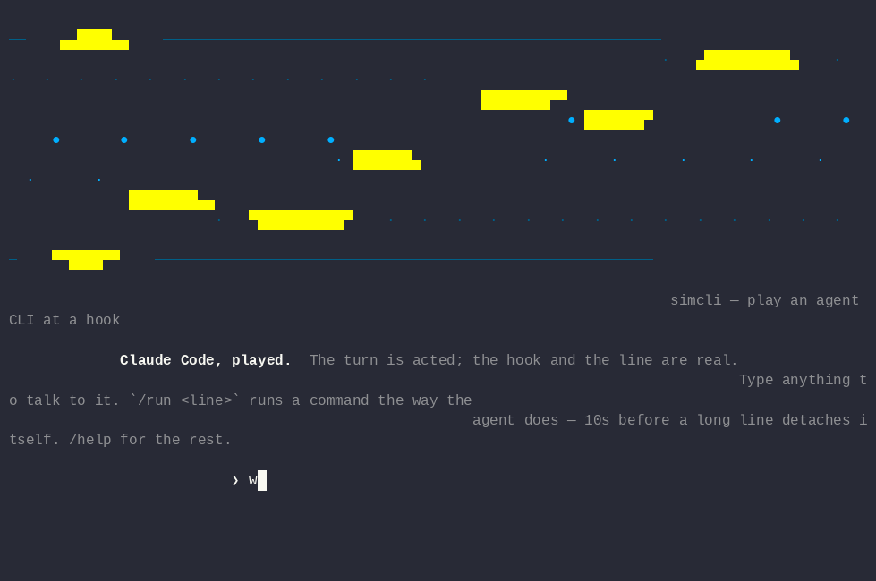

# simai-cli

**Play an agent CLI at a hook.**



The scenario, the recording and the render are all in `demo/`:

```console
simcli --as claude --script demo/detach.txt \
       --capture demo/detach.cast --size default
agg --font-family "Liberation Mono" demo/detach.cast demo/detach.gif
```

Everything after `● Bash(` is real — the payload, the hook, the
rewritten line, the wait, the moment it lets go. The cut is set to 10s
here so the recording stays watchable; the default is 30s, and the
scenario says so on screen rather than leaving you to find out.

It goes through no `simcli cast` treatment on purpose: speeding it up
would contradict the "10s" printed in the frame, and that is the one
number a demo of a threshold must not blur.

## What it needs

**To run: nothing.** TypeScript to build, and Node — no runtime
dependency at all.

Three verbs hand off to a tool simcli does not carry, and `simcli tools`
says which of them this machine has:

```console
$ simcli tools
simcli needs nothing to run. These are for what it hands off to:

  ✓ tmux       simcli capture — reading a real client's pane
  ✗ agg        turning a .cast into a GIF
    cargo install --locked --git https://github.com/asciinema/agg
    or a prebuilt binary: https://github.com/asciinema/agg/releases
  ✓ asciinema  playing or sharing a .cast
  ✓ ffmpeg     turning that GIF into an MP4

1 missing, dnf on this machine
```

The install line is built from the package manager the machine actually
has — dnf, apt-get, pacman, zypper or brew — not from the one this was
written on. Naming the wrong one is worse than saying nothing, because
it gets tried.

**`agg` is named by its repository, never as a bare crate.** `cargo
install agg` resolves to an unrelated crates.io library at 0.1.0 with no
binary in it and fails with *"there is nothing to install"*, which reads
like a broken toolchain rather than a wrong name.

## Build

```console
npm test               # 14 tests, no dependency beyond Node
./install.sh --check   # what it hands off to, and what is missing
./install.sh           # install those, after asking
```


```console
npm install
npm run build
```

TypeScript to build, **nothing at runtime**. Node 18 or later.

## Written for

[jbx](https://github.com/quazardous/jobbox), which wraps every command an
agent runs and detaches the ones that turn out to be long. It is not
required — the hook contract is the client's, not jbx's.

MIT. Third-party material in `THIRD-PARTY.md`.
